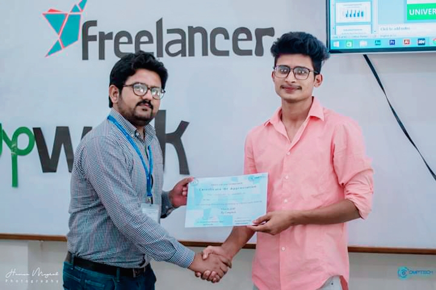

  

<h1 align="center">Greetings, everyone!   This is Saim Abbas here 👋</h1>
<h4 align="center">
🔥𝗧𝗼𝗽-𝗥𝗮𝘁𝗲𝗱 𝗦𝗲𝗹𝗹𝗲𝗿 𝗼𝗻 𝗙𝗶𝘃𝗲𝗿𝗿🔥vetted as "𝗙𝗜𝗩𝗘𝗥𝗥'𝗦 𝗖𝗛𝗢𝗜𝗖𝗘" on my Gigs
</h4>
 

Greetings! I am Saim Abbas 🙋‍♂️, a passionate and dedicated Frontend Developer specializing in React, based in the cultural heart of Pakistan - Multan. In addition to my freelance endeavors, I'm proud to serve as a **Senior Frontend Engineer at 5D Solutions, Dubai LLC.**

In my role at 5D Solutions, I have the privilege of leading a talented front-end team 👥, managing intricate front-end views, and integrating APIs to ensure smooth, seamless experiences 💻. The balance between my freelance commitments and corporate role enriches my perspective and amplifies my problem-solving skills 💡.

Reflecting on my journey of the last five years in web development, I've navigated the terrain of various projects for both start-ups 🚀 and large-scale enterprises 🏢. I've grappled with complex front-end bugs 🐞, mastered API integrations 🧩, and faced countless challenges in both web development and freelancing landscapes 🌐.

However, overcoming these challenges has been instrumental in honing my skills and enhancing my resilience 💪. Today, I am a seasoned developer, equipped with the knowledge, expertise, and determination to tackle any front-end challenges that come my way. I look forward to the opportunities and challenges that await in the ever-evolving world of web development 🌱.

 
<h2 align="center">🛠 Tools and Technologies I Use</h2>  
🔷 HTML / HTML5  
🔷 CSS / CSS3  
🔷 JAVASCRIPT / JQUERY / TYPESCRIPT  
🔷 REACT / NEXT.JS / JSX  
🔷 CSS PREPROCESSORS [Sass / Less]  
🔷 CSS LIBRARIES [Bootstrap / MUI / Tailwind Css]  
🔷 REACT CSS LIBRARIES [Ant Design / Styled Components]  
🔷 WEB ANIMATIONS [Gsap / Three.js / Css3 Animations]  
🔷 Axios, Webpack  
🔷 VERSION CONTROL SYSTEMS [GitHub / GitLab / BitBucket]  
🔷 UI/UX DESIGN [Adobe XD / Figma]  
🔷 CMS SYSTEMS [WordPress / Shopify / Wix / Squarespace]  
🔷 COLLABORATION TOOLS [Slack / Trello / Monday / Asana / Jira]  

 
<h2 align="center">🛠 Let's Connet</h2>

<!--
**saimabbas/saimabbas** is a ✨ _special_ ✨ repository because its `README.md` (this file) appears on your GitHub profile.

Here are some ideas to get you started:

- 🔭 I’m currently working on ...
- 🌱 I’m currently learning ...
- 👯 I’m looking to collaborate on ...
- 🤔 I’m looking for help with ...
- 💬 Ask me about ...
- 📫 How to reach me: ...
- 😄 Pronouns: ...
- ⚡ Fun fact: ...
-->
